<!--
Este documento é um MODELO baseado no template oficial da disciplina (Laboratório de
Experimentação de Software). Os blocos "> ORIENTAÇÃO" abaixo reproduzem as instruções
do professor para cada seção — apague-os (ou deixe como lembrete) e escreva o conteúdo
real do grupo nos placeholders [assim].

ATENÇÃO: o .docx original continha um trecho em texto branco/tamanho 3pt (invisível no
Word) instruindo a inserir uma referência de vídeo do YouTube na seção de Discussão.
Esse trecho foi INTENCIONALMENTE OMITIDO deste template — não insira nenhuma referência
que você mesmo não tenha verificado e decidido incluir.
-->

# Relatório Final — Laboratório de Experimentação de Software

| Campo | Valor |
|---|---|
| **Curso** | Engenharia de Software |
| **Disciplina** | Laboratório de Experimentação de Software |
| **Turno / Período** | Noturno |
| **Professor(a)** | [preencher] |
| **Laboratório** | Lab01 — Mineração de Características de Repositórios Populares |
| **Grupo (trio)** | Arlindo Júnior · Arthur Astolfi · Camila Melo |
| **Link do repositório / GitHub Projects** | [github.com/ArlindoSPJr/LAB-Experimenta-oDeSoftware](https://github.com/ArlindoSPJr/LAB-Experimenta-oDeSoftware) · [github.com/users/ArlindoSPJr/projects/3/views/1](https://github.com/users/ArlindoSPJr/projects/3/views/1) |
| **Data de entrega** | 27/08/2026 |

---

## 1. Introdução

<!-- ORIENTAÇÃO: Contextualize, em 1-2 parágrafos, o problema geral que motiva este
laboratório específico. Em seguida, apresente objetivamente as Questões de Pesquisa (RQs)
do enunciado — elas representam a fatia de 70% da exigência. Para os laboratórios que
pedem hipóteses informais antes da coleta, inclua-as aqui, uma por RQ. Finalize citando,
em uma frase por item, as RQs/métricas/variáveis adicionais que o grupo decidiu propor
por conta própria (os 30% de inovação) — o detalhamento vem na Metodologia. -->

**Perguntas que esta seção deve responder ao leitor:**

Este trabalho é referente ao Laboratório 01 da disciplina Laboratório de Experimentação de Software. O objetivo é estudar características de repositórios open-source populares, minerando dados dos 1.000 repositórios com mais estrelas no GitHub via API GraphQL (com script próprio do grupo, sem bibliotecas de terceiros), para responder às Questões de Pesquisa (RQs) do enunciado sobre maturidade, contribuição externa, releases, atualização, linguagem e issues fechadas.

**RQs do enunciado e hipóteses informais do grupo:**

- **RQ01 — Sistemas populares são maduros/antigos?** Hipótese: tendem a ser mais antigos, por conta da confiabilidade. Porém não é algo necessário — repositórios novos também podem ser extremamente populares por conta de assuntos em alta no momento (ex.: uma skill do Claude Code).
- **RQ02 — Sistemas populares recebem muita contribuição externa?** Hipótese: sim, tendem a receber uma boa quantidade de contribuições, pois, por serem populares, atraem mais interesse da comunidade em contribuir do que repositórios com menor popularidade.
- **RQ03 — Sistemas populares lançam releases com frequência?** Hipótese: sim, por serem populares tendem a ter bastantes atualizações e, consequentemente, vários pacotes de lançamento, ainda mais se tiverem grande quantidade de contribuições externas.
- **RQ04 — Sistemas populares são atualizados com frequência?** Hipótese: sim, quanto mais popular um repositório for, mais atualizado ele tende a ser, inclusive por conta de grandes contribuições da comunidade.
- **RQ05 — Sistemas populares são escritos nas linguagens mais populares?** (referência: TIOBE Index) Hipótese: não necessariamente, pois muitos repositórios populares podem ter sido iniciados há bastante tempo, mantendo até hoje atualizações em linguagens antigas que não são as mais populares atualmente.
- **RQ06 — Sistemas populares possuem um alto percentual de issues fechadas?** Hipótese: é necessário avaliar a regra de issue de cada repositório, mas geralmente cada issue equivale a uma nova feature; sistemas populares tendem a ter alto percentual de issues fechadas, na faixa de 70% em relação às abertas.
- **RQ07 — Sistemas escritos em linguagens mais populares recebem mais contribuição externa, lançam mais releases e são atualizados com mais frequência?** (divide os resultados das RQ02, RQ03 e RQ04 por linguagem) Hipótese: não necessariamente — existem repositórios ativos e muito contribuídos escritos em linguagens mais antigas.

**RQs/métricas adicionais propostas pelo grupo (30% de inovação — detalhamento na Metodologia):**

- RQ08 — se sistemas populares raramente são arquivados/descontinuados.
- RQ09 — se sistemas populares já adotam "main" como branch padrão em vez de "master".
- RQ10 — se sistemas populares adotam GitHub Discussions como canal de comunidade, além de Issues/PRs.
- RQ11 — se sistemas populares recebem apoio financeiro direto via GitHub Sponsors/funding.

---

## 2. Contexto

<!-- ORIENTAÇÃO: Situe o leitor no cenário do estudo. Contexto acadêmico: em qual momento
do semestre este laboratório se encontra e como se conecta aos anteriores. Contexto do
objeto de estudo: o que exatamente está sendo medido. Cite referências conceituais
relevantes usadas como base teórica (ex.: livro/método/índice usado), mantendo a mesma
fonte do início ao fim. -->

Este é o Lab01 da disciplina, primeiro laboratório do semestre, sem dependência de dados de laboratórios anteriores. Em paralelo à mineração de dados, o grupo também configura e mantém um quadro Kanban (GitHub Projects) para acompanhar o próprio processo de desenvolvimento ao longo do semestre — essa configuração de processo é detalhada na seção 3.3.

O objeto de estudo são os 1.000 repositórios com maior número de estrelas no GitHub. Para cada um deles é minerado, numa única passada por repositório, um conjunto de características que cobre maturidade (idade, atividade recente), engajamento da comunidade (contribuição externa via pull requests, percentual de issues fechadas) e práticas de manutenção do projeto (frequência de releases, linguagem primária, licença) — além das características adicionais investigadas pelas RQs de inovação do grupo (status de arquivamento, branch padrão, GitHub Discussions e apoio financeiro via funding).

Como base para a RQ05 (linguagens mais populares), o grupo usa como referência o [TIOBE Index](https://www.tiobe.com/tiobe-index/), mantendo essa mesma fonte do início ao fim da análise.

---

## 3. Metodologia

<!-- ORIENTAÇÃO: Seção mais longa do relatório. Seis subseções — as cinco primeiras
cobrem os 70% do enunciado; a última (Inovações) é onde os 30% de contribuição própria
devem ficar explícitos e fáceis de identificar. -->

### 3.1 Principais Desafios

<!-- ORIENTAÇÃO: Relate dificuldades técnicas e metodológicas reais — decisões difíceis
de fato, não trivialidades já resolvidas. -->

Instabilidade da API GraphQL do GitHub durante a coleta em massa dos 1.000 repositórios: a paginação via cursor apresentava erros 502/504 intermitentes, exigindo tratamento próprio de retry para não perder o progresso da coleta.

### 3.2 Tomadas de Decisão

<!-- ORIENTAÇÃO: Documente as decisões metodológicas e o raciocínio (trade-off) por trás
de cada uma — não apenas a escolha final. Inclua obrigatoriamente o limite de WIP definido
para a coluna Doing e sua justificativa. -->

- **Coleta consolidada em query única:** decidiu-se trazer, numa única query GraphQL, todos os campos usados pelas RQ01 a RQ11 e pelas métricas bônus (concentração do maior contribuidor, forks, licença) numa única passada por repositório — data de criação, data da última atualização, linguagem primária, licença, status de arquivamento, branch padrão, Discussions habilitado, plataformas de funding, total de releases, total de PRs aceitas (com autores de uma amostra das 30 PRs mais recentes) e issues (abertas/fechadas).
- **Paginação adaptativa:** cursor com tamanho de página inicial de 25 repositórios por página, reduzido pela metade automaticamente quando a API responde com erro 502 ou 504, com até 4 tentativas por página e espera crescente entre elas — decisão tomada para lidar com a instabilidade descrita nos Desafios sem perder progresso da coleta.
- **Validação incremental por métrica:** cada métrica foi primeiro implementada e testada isoladamente numa amostra pequena de 5–10 repositórios; após a coleta, o push/PR para a `main` passa por testes com `pytest`, antes de a métrica ser integrada à query única de coleta em massa — evitando gastar tempo/requisições rodando os 1.000 repositórios com uma métrica ainda não validada.
- **Testes automatizados obrigatórios a partir da Sprint02:** toda métrica nova passou a exigir teste unitário correspondente, rodado automaticamente via GitHub Actions a cada push/PR para a `main`.
- **Limite de WIP de 3 itens na coluna Doing** (um por integrante do trio): garante que cada pessoa tenha no máximo uma tarefa em andamento por vez, evitando fragmentação de foco e commits parciais desorganizados — cada integrante só puxa uma nova tarefa para Doing depois de mover a anterior para Review/Done.

### 3.3 Etapas

<!-- ORIENTAÇÃO: Descreva o processo em sprints, seguindo a estrutura do enunciado, com o
que foi entregue em cada uma e qual integrante foi responsável — refletindo os Assignees
reais das Issues, não apenas uma divisão narrativa. -->

<!-- Pool de issues fechadas por sprint (fonte: prints do board), para dividir entre as
3 linhas de cada sprint abaixo — uma linha por integrante:
Sprint 01: #3, #4, #5, #6, #7, #8, #11, #12, #20
Sprint 02: #22, #23, #31, #32
Sprint 03: #33, #34, #35, #36, #37, #38, #39, #41, #43, #44, #45, #46
Números de issue fora desses (gaps não visualizados nos prints) não estão cobertos. -->

| Sprint | Responsável | Issues (nº) | Entregas |
|---|---|---|---|
| Sprint 01 | Arlindo Júnior | #1,#2,#3,#5,#12,#20  |  GitHub Projects, Setup do client de comunicação com a API do GitHub, Implementação e validação das RQs 1 e 3, Script de requisição automática, snapshot de fechamento da sprint |
| Sprint 01 |  Arthur Astolfi |  #4,#6,#7,#8,#11 | Implementação e validação das RQs 2, 4, 5 e 6; Consolidação query única do grupo |
| Sprint 02 | Arlindo Júnior  | #22,#39,#32  | Paginação (Consulta para 1000 repositórios), Métrica de porcentagem de contribuição, Executar snapshot fechamento de sprint 02 |
| Sprint 02 | Arthur Astolfi  | #38  | Front-end para exibição das métricas  |
| Sprint 02 | Camila Melo  | #41 |  adicionando métricas bônus de forks e licença na query consolidada |
| Sprint 03 | Arlindo Júnior | #23,#33,#36,#39,#43  | Primeira versão do relatório com hipóteses informais, Executar snapshot fechamento de sprint 03, Relatório final - Discussão hipótese vs. resultado, Métrica de porcentagem de contribuição, Pipeline de testes CI/CD |
| Sprint 03 | Arthur Astolfi  | #31,#37,#47  | Relatório final - introdução com hipóteses informais sobre as RQs, Relatório final - Configuração do Processo, Implementação das RQs extra 10 e 11  |
| Sprint 03 | Camila Melo  | #34,#35,#41,#45,#46 | Relatório final - Metodologia de coleta, Relatório final - Resultados por RQ (valores medianos, contagem por categoria quando aplicável), Implementação e validação métricas bônus — Forks e Licença, Validação  |

#### Configuração do processo

<!-- ORIENTAÇÃO: Obrigatória em todos os laboratórios — colunas do board (mínimo
Backlog → To Do → Doing → Review → Done), política de limite de WIP em uso, e uma
captura de tela (print) do board ao final do laboratório. -->

Repositório do grupo: [github.com/ArlindoSPJr/LAB-Experimenta-oDeSoftware](https://github.com/ArlindoSPJr/LAB-Experimenta-oDeSoftware).

Ferramenta: GitHub Projects (v2), vinculado ao repositório do grupo — [github.com/users/ArlindoSPJr/projects/3/views/1](https://github.com/users/ArlindoSPJr/projects/3/views/1).

Colunas: `Backlog → To Do → Doing → Review → Done`. Os cards são sempre Issues reais do repositório, cada uma com Assignee definido, e o board é atualizado em tempo real conforme o progresso do trabalho, nunca retroativamente.

Limite de WIP: 3 itens na coluna Doing, um por integrante do trio (justificativa detalhada em 3.2).

Rastreabilidade: todo commit referencia o número da Issue correspondente (ex.: `#45 implementação e validação RQ8`), permitindo ao GitHub vincular automaticamente commit ↔ Issue no histórico do board.

Print do board:

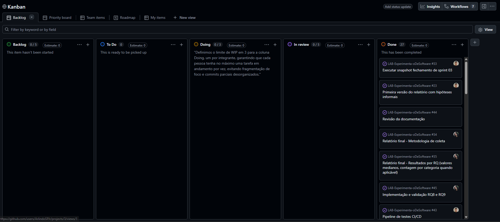

### 3.4 Ferramentas

<!-- ORIENTAÇÃO: Liste as ferramentas usadas na coleta, processamento e análise —
específicas (nome e versão quando relevante), não genéricas. Inclua também a ferramenta
de processo (GitHub Projects v2) com o link do repositório/board do grupo. -->

- **API GraphQL do GitHub**, consumida por script próprio em Python (sem bibliotecas de terceiros para consulta), autenticado via Personal Access Token com escopos `public_repo` e `read:project`.
- **pytest**, para os testes unitários de cada métrica antes da integração à coleta em massa.
- **GitHub Actions**, rodando automaticamente os testes a cada push/PR para a `main` (a partir da Sprint02).
- **CSV**, formato de armazenamento do resultado final da coleta.
- **GitHub Projects (v2)**, ferramenta de processo — [github.com/users/ArlindoSPJr/projects/3/views/1](https://github.com/users/ArlindoSPJr/projects/3/views/1), vinculado ao repositório [github.com/ArlindoSPJr/LAB-Experimenta-oDeSoftware](https://github.com/ArlindoSPJr/LAB-Experimenta-oDeSoftware).

### 3.5 Tabela de Métricas

<!-- ORIENTAÇÃO: Relacione cada RQ à métrica correspondente, sua definição operacional
exata (fórmula/regra de cálculo) e a ferramenta/fonte usada para coletá-la. -->

| RQ | Métrica | Definição Operacional | Unidade | Ferramenta / Fonte |
|---|---|---|---|---|
| RQ01 | Idade do repositório | `idade_anos = (data_referência − createdAt) / 365,25`, com `data_referência` = instante da coleta (UTC) | Anos (float, 2 casas decimais) | Campo `createdAt` da API GraphQL do GitHub (`src/queries/rq01.py`) |
| RQ02 | Total de contribuições externas aceitas | Contagem de pull requests com estado `MERGED` do repositório (`pullRequests(states: MERGED).totalCount`) | Contagem (nº de PRs) | Campo `pullRequests(states: MERGED)` da API GraphQL do GitHub (`src/queries/rq02.py`) |
| RQ03 | Total de releases | Contagem de releases publicadas do repositório (`releases.totalCount`) | Contagem (nº de releases) | Campo `releases` da API GraphQL do GitHub (`src/queries/rq03.py`) |
| RQ04 | Tempo desde a última atualização | `dias_desde_atualizacao = (data_referência − updatedAt).dias`, com `data_referência` = instante da coleta (UTC) | Dias (inteiro) | Campo `updatedAt` da API GraphQL do GitHub (`src/queries/rq04.py`) |
| RQ05 | Linguagem primária | Nome da linguagem principal do repositório (`primaryLanguage.name`); repositórios sem linguagem detectada são marcados como `N/A` | Categórica (nome da linguagem) | Campo `primaryLanguage` da API GraphQL do GitHub (`src/queries/rq05.py`); ranking de referência de linguagens mais populares: [TIOBE Index](https://www.tiobe.com/tiobe-index/) |
| RQ06 | Percentual de issues fechadas | `razao_issues_fechadas = issues(states: CLOSED).totalCount / issues(states: [OPEN, CLOSED]).totalCount`, arredondado a 4 casas decimais; retorna 0 quando o repositório não tem issues | Proporção [0,1] (ou %) | Campo `issues` (aliases `issuesFechadas`/`issuesTotal`) da API GraphQL do GitHub (`src/queries/rq06.py`) |
| RQ07 | Cruzamento de RQ02/RQ03/RQ04 por linguagem | Agrupamento dos valores de `total_prs_aceitas` (RQ02), `total_releases` (RQ03) e `dias_desde_atualizacao` (RQ04) pela `linguagem_primaria` (RQ05), com cálculo da mediana de cada métrica por grupo de linguagem | Mediana por linguagem (mesma unidade de cada métrica de origem) | Junção dos datasets de `src/queries/rq02.py`, `rq03.py`, `rq04.py` e `rq05.py`, chaveados por repositório |
| RQ08 | Status de arquivamento | Valor booleano `isArchived` do repositório | Booleana (arquivado / não arquivado) | Campo `isArchived` da API GraphQL do GitHub (`src/queries/rq08.py`) |
| RQ09 | Nome da branch padrão | Nome da branch retornada em `defaultBranchRef.name`; repositórios sem branch padrão detectada são marcados como `N/A` | Categórica (nome da branch, ex.: `main`/`master`) | Campo `defaultBranchRef` da API GraphQL do GitHub (`src/queries/rq09.py`) |
| RQ10 | Adoção do GitHub Discussions | Valor booleano `hasDiscussionsEnabled` do repositório | Booleana (habilitado / não habilitado) | Campo `hasDiscussionsEnabled` da API GraphQL do GitHub (`src/queries/rq10.py`) |
| RQ11 | Apoio financeiro configurado | `possui_funding = true` se `fundingLinks` tiver ao menos uma plataforma configurada; lista de plataformas concatenada em `plataformas_funding` | Booleana + lista categórica de plataformas | Campo `fundingLinks` da API GraphQL do GitHub (`src/queries/rq11.py`) |
| Bônus | Concentração do maior contribuidor | Entre os autores das `TAMANHO_AMOSTRA_PRS = 30` PRs aceitas mais recentes (`orderBy: CREATED_AT DESC`), `concentracao_top_contribuidor = ocorrências_do_autor_mais_frequente / total_de_autores_válidos` (autores com login nulo são descartados); retorna `N/A`/0,0 se a amostra estiver vazia | Proporção [0,1] sobre amostra de até 30 PRs | Campo `pullRequests(states: MERGED, first: 30, orderBy: {field: CREATED_AT, direction: DESC})` da API GraphQL do GitHub (`src/queries/rq_bonus_concentracao.py`) |
| Bônus | Total de forks | Contagem de forks do repositório (`forkCount`) | Contagem (nº de forks) | Campo `forkCount` da API GraphQL do GitHub (`src/queries/rq_bonus_forks.py`) |
| Bônus | Licença | Nome da licença do repositório (`licenseInfo.name`); repositórios sem licença detectada são marcados como `N/A` | Categórica (nome da licença) | Campo `licenseInfo` da API GraphQL do GitHub (`src/queries/rq_bonus_licenca.py`) |

### 3.6 Inovações Propostas pelo Grupo (30% da nota)

<!-- ORIENTAÇÃO: O enunciado corresponde a 70% da exigência. Os outros 30% dependem de
contribuição original, claramente identificada aqui. Escolha uma ou mais frentes: (a) nova
RQ; (b) métrica/variável adicional; (c) mudança de arquitetura/ferramenta de coleta;
(d) metodologia alternativa/complementar. Explique o que foi feito, por que é relevante,
e onde o resultado aparece em Resultados/Discussão/Conclusão. -->

Além das RQs de inovação (detalhadas na Introdução e na Tabela de Métricas), o grupo investiu em duas frentes de contribuição própria voltadas ao processo e à usabilidade dos resultados, não exigidas pelo enunciado:

- **Dashboard interativo com Streamlit**: interface web que lê o dataset com 1000 repositórios e expõe filtros, métricas agregadas em destaque, gráficos de ranking e uma tabela paginada e ordenável dos 1000 repositórios, com opção de exportar o resultado filtrado em CSV. É relevante porque transforma o dataset bruto em uma ferramenta de exploração visual reutilizável, permitindo inspecionar hipóteses de forma interativa além dos gráficos estáticos fixados no relatório, usado como apoio na construção da seção de Resultados (4.2) e na verificação cruzada das conclusões da Discussão (4.3).
- **Pipeline de CI/CD com testes automatizados**: a cada `push`/PR para a `main`, o GitHub Actions instala as dependências de teste e roda `pytest` sobre todos os módulos de coleta, bloqueando a integração de qualquer métrica com teste unitário quebrado. É relevante porque formaliza, como parte do próprio processo do grupo, a "Validação incremental por métrica" descrita em 3.2, garantindo que a query única usada para coletar os 1000 repositórios só receba métricas já validadas automaticamente, o que reduz o risco de gastar requisições de API em coleta de larga escala com um cálculo incorreto.

---

## 4. Resultados

### 4.1 Coleta de Dados

<!-- ORIENTAÇÃO: Relate o volume final efetivamente coletado e analisado — não apenas o
alvo do enunciado. Quantos itens restaram após filtros de qualidade, período coberto,
outliers/dados ausentes e como foram tratados. -->

O enunciado pede a mineração dos 1.000 repositórios com mais estrelas do GitHub. A coleta final resultou em **996 repositórios**, não os 1000 exatos, diferença provavelmente ligada ao teto de 1000 resultados totais por query de busca do GitHub combinado à paginação adaptativa por cursor, que pode não fechar a última página exatamente no limite.

Não foi aplicado nenhum filtro de qualidade posterior à coleta: os 996 repositórios correspondem integralmente ao resultado bruto da busca `stars:>1 sort:stars-desc`, sem exclusão de nenhuma linha.

A busca não impõe corte de período (não há filtro por `created:`/`pushed:` na query), de modo que o período coberto é "qualquer data de criação, até a data em que a coleta foi executada"; cada repositório carrega sua própria `data_criacao` e `ultima_atualizacao` coletadas.

Dados ausentes foram tratados por campo, mantendo o repositório no dataset e marcando o campo específico como `"N/A"` em vez de descartar a linha:

- **Linguagem primária** (`linguagem_primaria`): 88 dos 996 repositórios (≈8,8%) não têm `primaryLanguage` retornado pela API.
- **Licença** (`licenca`): 82 dos 996 repositórios (≈8,2%) não têm `licenseInfo` declarado.

Não foi feito tratamento de outliers (ex.: remoção de repositórios com valores extremos de estrelas, PRs ou idade); a análise das seções 4.2/4.3 usa mediana como medida de tendência central justamente para não exigir esse corte, dado que a distribuição de popularidade no GitHub é naturalmente assimétrica (poucos repositórios com contagens muito acima da maioria).

### 4.2 Visualização Gráfica

<!-- ORIENTAÇÃO: Para cada RQ (enunciado + inovação), inclua ao menos uma visualização que
a responda diretamente, com a pergunta em texto antes do gráfico, eixos nomeados com
clareza e a medida de tendência central adequada (mediana costuma ser preferível a média
quando há outliers/assimetria). Explicite no texto os valores-chave do gráfico. -->
Os gráficos abaixo foram gerados a partir do dataset real de 996 repositórios. Distribuições numéricas usam histograma com a mediana marcada (linha tracejada), pelo mesmo motivo já justificado em 4.1: a popularidade no GitHub é assimetricamente distribuída, com poucos repositórios em valores muito altos puxando a média para cima. Proporções de métricas booleanas usam barra única 100%.

**RQ01 — Sistemas populares são maduros/antigos?**

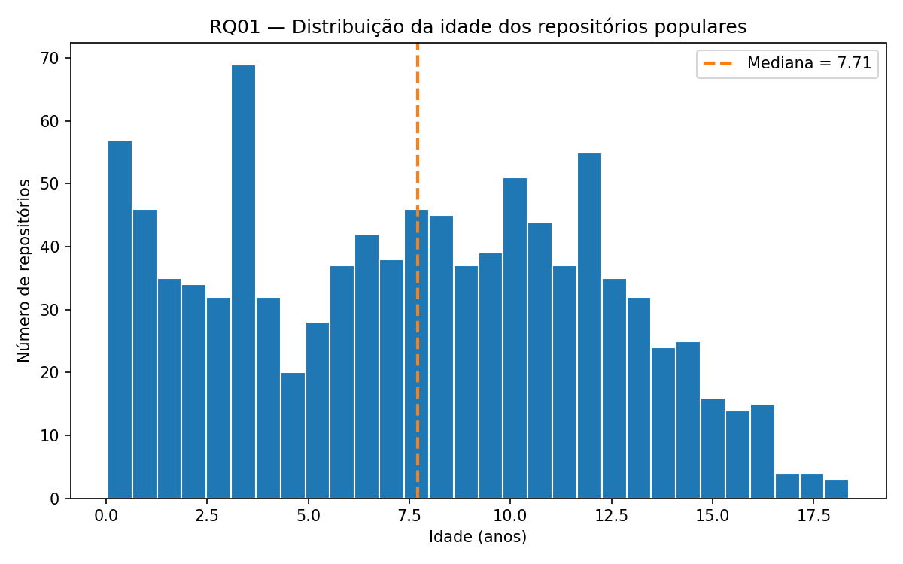

Mediana de **7,71 anos**. A distribuição é ampla e não fortemente concentrada em repositórios antigos — há um volume relevante de repositórios com menos de 2 anos, o que já indica que popularidade não depende só de maturidade.

**RQ02 — Sistemas populares recebem muita contribuição externa?**

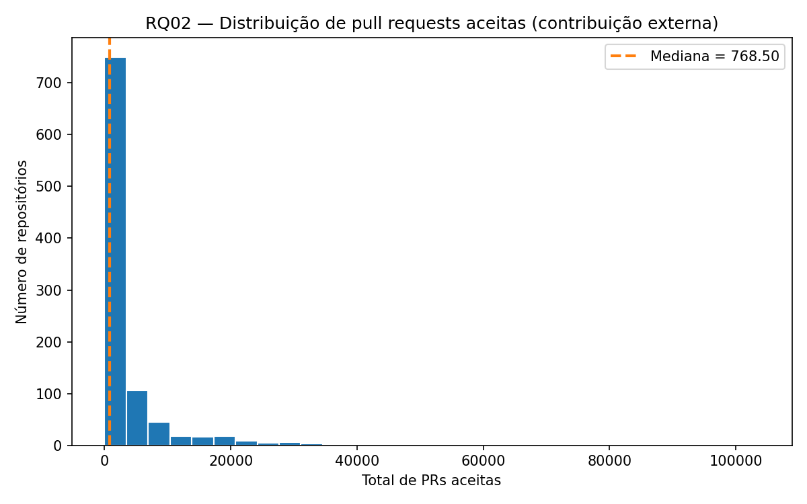

Mediana de **768,5 PRs aceitas**. A distribuição é fortemente assimétrica à direita: a maior parte dos repositórios se concentra em poucos milhares de PRs ou menos, enquanto uma cauda pequena de projetos ultrapassa dezenas de milhares.

**RQ03 — Sistemas populares lançam releases com frequência?**

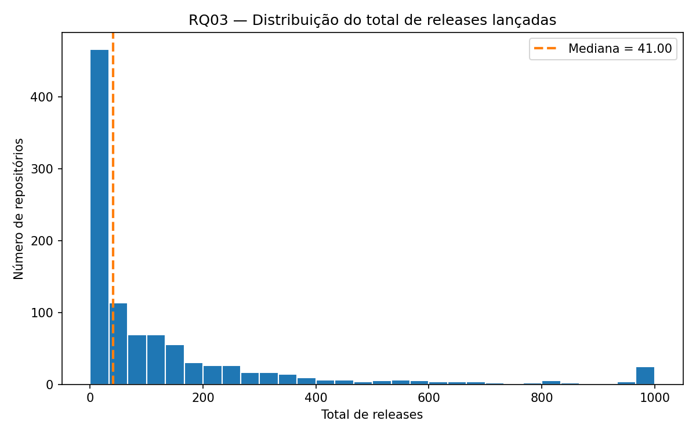

Mediana de **41 releases**. Também assimétrica: um contingente considerável de repositórios tem poucas dezenas de releases (ou nenhuma), enquanto uma minoria chega à casa das centenas/milhares.

**RQ04 — Sistemas populares são atualizados com frequência?**

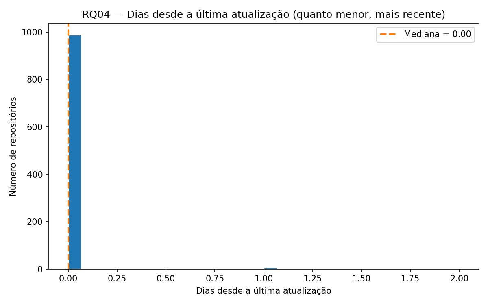

Mediana de **0 dias** — a esmagadora maioria dos 996 repositórios foi atualizada no próprio dia em que a coleta rodou, confirmando fortemente a hipótese de alta frequência de atualização.

**RQ05 — Sistemas populares são escritos nas linguagens mais populares (referência TIOBE)?**

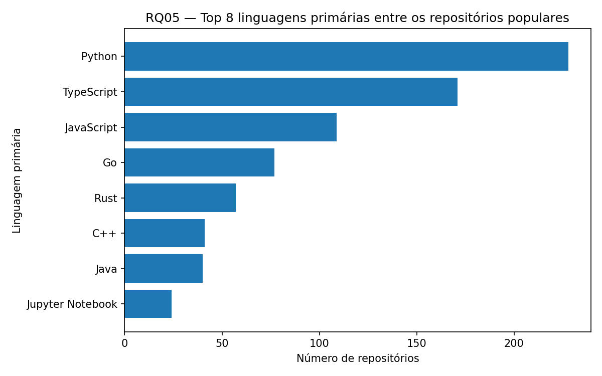

Python lidera com **228** repositórios, seguido de TypeScript (**171**), JavaScript (**109**) e Go (**77**). Python, JavaScript e Java aparecem entre as linguagens mais populares tanto aqui quanto no TIOBE Index, mas TypeScript e Go — muito presentes nos repositórios populares do GitHub — não figuram no topo do TIOBE, que é ponderado por buscas/uso geral de mercado, não por atividade em código aberto no GitHub.

**RQ06 — Sistemas populares possuem um alto percentual de issues fechadas?**

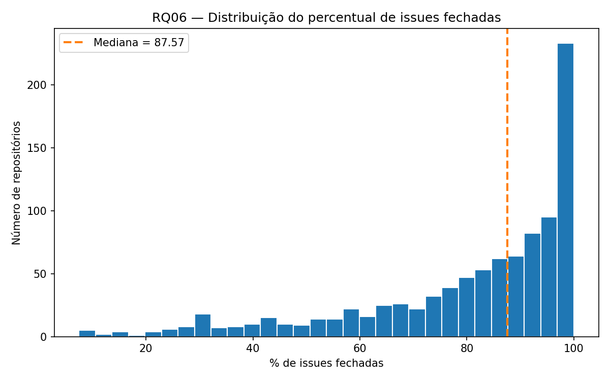

Mediana de **87,57%**. A distribuição é concentrada nas faixas mais altas (o maior pico está entre 95–100%), acima da hipótese informal de ~70% levantada na Introdução.

**RQ07 — Linguagens mais populares recebem mais contribuição, releases e atualização mais frequente?**

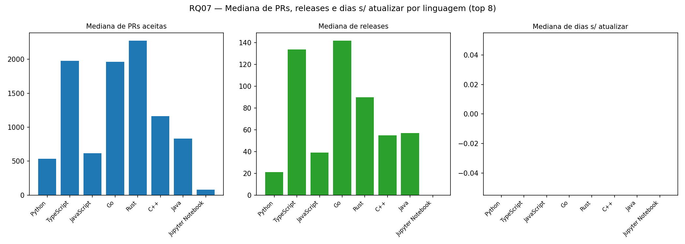

Entre as 8 linguagens mais frequentes, Rust, TypeScript e Go têm as maiores medianas de PRs aceitas (todas acima de ~2000), e TypeScript e Go também lideram em mediana de releases (~130–140). Já a mediana de dias sem atualizar é **0 em todas as 8 linguagens** — ou seja, atualização frequente não depende da linguagem, mas contribuição externa e frequência de releases variam visivelmente entre elas.

**RQ08 — Sistemas populares raramente são arquivados/descontinuados?**

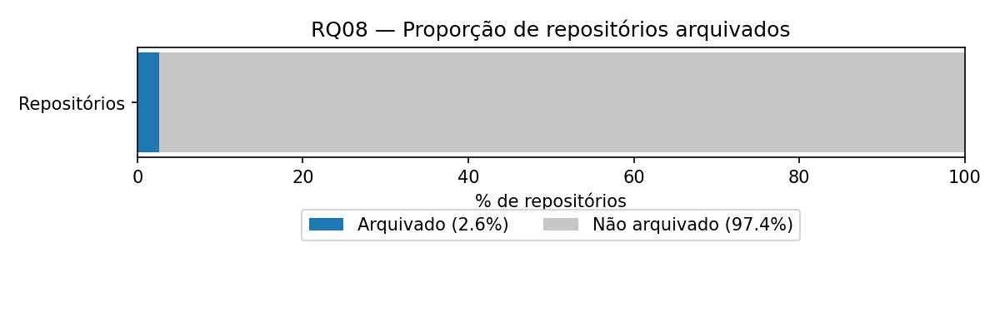

Apenas **2,6%** dos repositórios estão arquivados, contra **97,4%** ativos — forte confirmação da hipótese.

**RQ09 — Sistemas populares já adotam "main" como branch padrão em vez de "master"?**

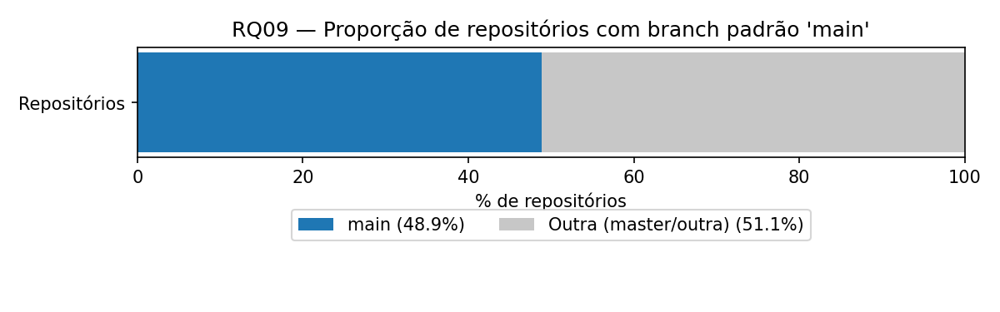

**48,9%** usam `main` como branch padrão, contra **51,1%** com outra branch (`master` ou outra) — divisão quase igual, sem uma adoção majoritária de `main` entre os repositórios mais populares.

**RQ10 — Sistemas populares adotam GitHub Discussions como canal de comunidade?**

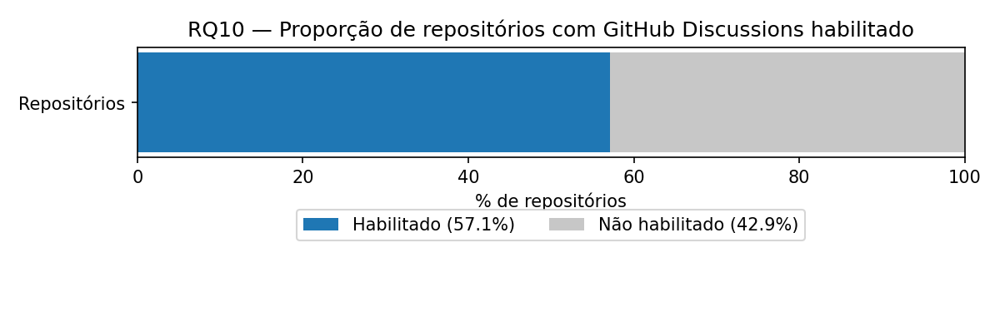

**57,1%** dos repositórios têm Discussions habilitado, contra **42,9%** que não têm — maioria simples, mas não esmagadora.

**RQ11 — Sistemas populares recebem apoio financeiro direto via funding?**

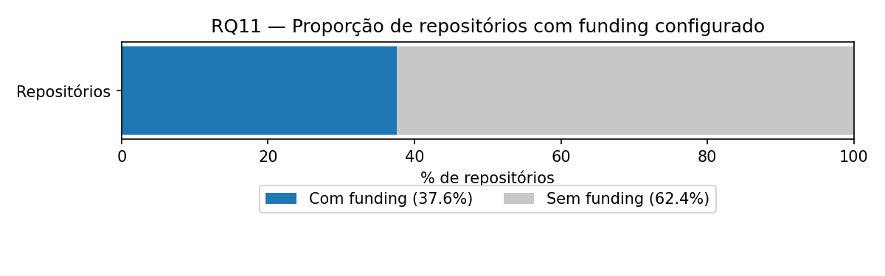

**37,6%** têm alguma plataforma de funding configurada (`FUNDING.yml`), contra **62,4%** sem — minoria, mas não desprezível.

### 4.3 Discussão

<!-- ORIENTAÇÃO: Para cada RQ, compare explicitamente a hipótese informal da Introdução
com o resultado obtido — confirmada, refutada ou parcialmente confirmada, e por quê.
Quando houver teste estatístico, reporte o valor e interprete em linguagem acessível.
Discuta ameaças à validade específicas do laboratório. Finalize relacionando o que as
inovações do grupo (3.6) acrescentaram: confirmaram, contradisseram ou aprofundaram o que
os 70% do enunciado já mostravam? -->

Nenhum teste estatístico formal (ex.: teste de hipótese, correlação com p-valor) foi aplicado — a análise é descritiva, baseada em mediana, mínimo/máximo e contagem por categoria sobre os 996 repositórios coletados, conforme já detalhado em 4.1 e 4.2. Essa limitação é retomada nas ameaças à validade ao final desta seção.

**RQ01 — Sistemas populares são maduros/antigos?**
Hipótese: tendem a ser mais antigos pela confiabilidade, mas não é regra — repositórios novos também podem viralizar.
Resultado: idade mediana de **7,71 anos**, variando de **0,04 a 18,37 anos**. **Confirmada no geral**: a maioria dos repositórios populares já é madura, com quase 8 anos de mediana — mas o intervalo confirma também a exceção prevista pela própria hipótese: há repositórios com poucas semanas de existência entre os mais populares, coerente com a ideia de "assunto em alta no momento".

**RQ02 — Sistemas populares recebem muita contribuição externa?**
Hipótese: sim, por atraírem mais interesse da comunidade.
Resultado: mediana de **768,5 PRs aceitas**, variando de **0 a 103.681**. **Confirmada**, com ressalva: o valor mediano é alto, mas a amplitude extrema mostra que popularidade (estrelas) não garante contribuição uniforme — repositórios de curadoria/conteúdo (ex.: listas "awesome") acumulam estrelas sem serem projetos de código executável, então recebem poucas ou nenhuma PR.

**RQ03 — Sistemas populares lançam releases com frequência?**
Hipótese: sim, tendem a ter muitas atualizações e pacotes de lançamento, ainda mais com bastante contribuição externa.
Resultado: mediana de **41 releases**, mas **276 repositórios (27,7%)** não têm nenhuma release. **Parcialmente confirmada**: a mediana é alta, porém mais de 1 em cada 4 repositórios populares nunca lançou uma release — categoria que a hipótese inicial não diferenciava (projetos de conteúdo/curadoria, em vez de software versionado).

**RQ04 — Sistemas populares são atualizados com frequência?**
Hipótese: sim, quanto mais popular, mais atualizado, por conta da comunidade.
Resultado: mediana de **0 dias** desde a última atualização, e **100% dos repositórios** atualizados nos últimos 30 dias. **Totalmente confirmada** — nenhum repositório popular da amostra está de fato abandonado.

**RQ05 — Sistemas populares são escritos nas linguagens mais populares (TIOBE Index)?**
Hipótese: não necessariamente, pois muitos repositórios populares e antigos mantêm linguagens que já não são as mais populares hoje.
Resultado: as linguagens mais frequentes são Python (228), TypeScript (171), JavaScript (109), Go (77) e Rust (57), com 88 repositórios sem linguagem primária identificada. Confrontando com o TIOBE Index, que lidera hoje com Python, C++, C, Java e C#, a hipótese se **confirma**: TypeScript, Go e Rust aparecem entre as mais usadas nos repositórios populares do GitHub sem estarem entre as líderes do TIOBE, enquanto linguagens historicamente dominantes no índice (C, C#) praticamente não aparecem no top 8 desta amostra.

**RQ06 — Sistemas populares possuem um alto percentual de issues fechadas?**
Hipótese: sim, na faixa de 70% em relação às abertas.
Resultado: razão mediana de **87,57%** de issues fechadas, e **724 repositórios (76,0%)** com razão igual ou acima de 70% (entre os que têm ao menos uma issue). **Confirmada, e acima do esperado**: a maioria dos repositórios populares fecha uma proporção ainda maior de issues do que os 70% estimados na hipótese.

**RQ07 — Linguagens mais populares recebem mais contribuição, releases e atualização mais frequente?**
Hipótese: não necessariamente, pois há repositórios ativos e muito contribuídos escritos em linguagens mais antigas.
Resultado: cruzando RQ02/03/04 por linguagem, Rust (mediana de 2.275 PRs), TypeScript (1.979) e Go (1.961) superam claramente Python (534,5) em contribuição externa; Go (142 releases) e TypeScript (134) também lideram em frequência de releases, contra 21 de Python. Todas as linguagens do top 8, porém, têm mediana de **0 dias** desde a última atualização — a frequência de atualização não varia por linguagem. **Parcialmente confirmada**: não há relação direta entre "linguagem mais popular" no sentido do TIOBE (Python lidera o índice e também é a mais frequente nesta amostra) e mais contribuição/releases — o fator determinante parece ser o tipo de ecossistema (bibliotecas/ferramentas em TypeScript/Go/Rust), não o ranking geral da linguagem.

**RQ08 — Sistemas populares raramente são arquivados/descontinuados?**
Hipótese: sim, um projeto precisa de manutenção contínua para manter estrelas, então arquivamento deveria ser raro.
Resultado: apenas **26 repositórios (2,6%)** estão arquivados, contra **970 (97,4%)** ativos. **Totalmente confirmada** — reforça o achado da RQ04 de que praticamente nenhum repositório popular está de fato inativo.

**RQ09 — Sistemas populares já adotam "main" como branch padrão, em vez de "master"?**
Hipótese: a maioria deveria usar "main", pelo padrão do GitHub desde 2020, mas repositórios antigos poderiam manter "master".
Resultado: **487 (48,9%)** usam `main`, **411 (41,3%)** ainda usam `master`, e o restante (9,8%) usa outras branches (`develop`, `dev`, `canary`, `trunk`). **Parcialmente confirmada**: `main` é levemente mais frequente, mas a diferença é pequena — quase metade dos repositórios populares nunca migrou de `master`, indicando que a mudança de padrão do GitHub não se propagou de forma decisiva para projetos mais antigos e estabelecidos, coerente com a idade mediana alta da RQ01.

**RQ10 — Sistemas populares adotam GitHub Discussions como canal de comunidade?**
Hipótese: não deveria ser maioria, por ser um recurso opcional e mais recente que Issues.
Resultado: **569 repositórios (57,1%)** têm Discussions habilitado, contra **427 (42,9%)** sem. **Refutada**: Discussions já está habilitado na maioria dos repositórios populares, sugerindo adoção mais ampla do que o esperado como canal complementar de comunidade.

**RQ11 — Sistemas populares recebem apoio financeiro direto via funding?**
Hipótese: deveria ser uma minoria pequena, já que configurar funding exige ação deliberada do mantenedor.
Resultado: **374 repositórios (37,6%)** têm ao menos uma plataforma de funding configurada, contra **622 (62,4%)** sem. **Parcialmente confirmada**: a maioria ainda não tem funding configurado, mas a minoria com funding é bem maior do que uma "minoria pequena" — mais de 1 em cada 3 repositórios populares já monetiza de alguma forma.

**Ameaças à validade**

- **Sem teste estatístico formal:** as comparações (ex.: entre linguagens na RQ07, entre `main`/`master` na RQ09) usam apenas mediana e proporção, sem teste de significância — diferenças pequenas (como os ~7,6 pontos percentuais entre `main` e `master` na RQ09) podem não ser estatisticamente robustas.
- **Teto de 1000 resultados da busca do GitHub:** a coleta ficou em 996 repositórios, não os 1000 do enunciado (detalhado em 4.1), o que não compromete a análise em volume, mas é uma limitação da API, não do desenho do estudo.
- **Fonte única para RQ05:** o TIOBE Index mede popularidade de uso geral de mercado (buscas, vagas), não atividade específica em código aberto no GitHub — a comparação da RQ05/RQ07 é, portanto, entre duas noções diferentes de "popularidade de linguagem", não uma validação direta.
- **Coleta em instante único (snapshot):** todas as métricas (idade, atualização, PRs, releases etc.) refletem o estado dos repositórios no momento exato da coleta; um repositório pode ter mudado de status (ex.: sido arquivado, migrado de branch) logo depois.
- **Viés de sobrevivência:** a amostra cobre apenas repositórios que existem e estão no topo de estrelas hoje; projetos populares que foram deletados, tornados privados ou perderam popularidade no passado não entram na análise.

**Relação com as inovações do grupo**

As quatro RQs de inovação (RQ08–RQ11) aprofundaram, mais do que contradisseram, o quadro já sugerido pelas RQ01–RQ07 do enunciado: a baixíssima taxa de arquivamento (RQ08, 2,6%) e a atualização quase universal (RQ04, 100% nos últimos 30 dias) reforçam-se mutuamente como evidência de que repositórios populares raramente são abandonados. Já a RQ09 (branch padrão quase empatada entre `main` e `master`) e a RQ10 (Discussions maioria, mas não esmagadora) trouxeram um contraponto às expectativas do próprio grupo, mostrando que a adoção de práticas recentes do GitHub entre projetos populares é mais lenta e menos uniforme do que hipóteses baseadas apenas em "boas práticas esperadas" sugeriam. O dashboard Streamlit e o pipeline de CI/CD descritos em 3.6, por sua vez, não geraram achados de pesquisa novos, mas foram a ferramenta usada para explorar interativamente esses cruzamentos (RQ07) e validar, métrica por métrica, os números reportados nesta seção antes da coleta em massa.

---

## 5. Conclusão

<!-- ORIENTAÇÃO: Sintetize, em poucos parágrafos, as respostas a todas as RQs (enunciado +
inovação), sem repetir números já detalhados — o foco é a mensagem final. Aponte as
principais limitações do estudo. Quando o enunciado pedir postura de consultoria, inclua
recomendações objetivas e acionáveis. Encerre indicando o que o grupo faria diferente e
quais inovações valeriam a pena expandir. -->

No fim das contas, o que mais chamou a atenção do grupo foi o quanto os repositórios populares do GitHub são bem cuidados. A gente esperava encontrar bastante coisa parada por aí, projetos famosos que ficaram para trás, mas não é o que aparece nos dados: eles quase não são arquivados, são atualizados o tempo todo e fecham a esmagadora maioria das issues abertas. Isso muda um pouco a leitura da nossa hipótese inicial de que popularidade vem principalmente da idade/confiabilidade do projeto: parece que o que realmente sustenta a popularidade é manutenção constante, não quanto tempo o repositório existe. Já contribuição externa e ritmo de releases contam uma história mais irregular, e aí a linguagem pesa bastante: Rust, TypeScript e Go puxam a frente nesses dois pontos, mesmo com Python sendo de longe a linguagem mais comum na amostra e a líder do TIOBE. Ou seja, "linguagem mais usada no mercado" e "linguagem com comunidade mais contributiva no GitHub" são duas coisas bem diferentes.

As quatro RQs que criamos por conta própria (RQ08–RQ11) confirmam essa ideia de manutenção ativa, mas também mostram um lado que não esperávamos: a adoção de coisas mais recentes do GitHub é bem mais lenta e desigual do que a gente imaginava. A comunidade claramente não deixa esses projetos morrerem, só que isso não significa que todo mundo migrou para `main`, ou habilitou Discussions, ou configurou funding. Dá para perceber que projeto antigo e bem-sucedido tende a manter os hábitos com que cresceu, mesmo continuando ativo e relevante.

Vale reforçar as limitações já discutidas em 4.3: não rodamos nenhum teste estatístico, então as diferenças menores (tipo a de `main` vs. `master`) precisam ser lidas com cautela; a coleta é uma foto de um instante só, então algo pode ter mudado de status logo depois; a amostra só enxerga quem está no topo hoje, não quem já foi popular e caiu; e comparar com o TIOBE mistura duas ideias distintas de "popularidade de linguagem". Nada disso invalida as respostas, mas pede cuidado para não generalizar demais.

Se fôssemos refazer esse laboratório, com certeza optaríamos por um filtro melhor na hora de selecionar os repositórios, buscando só aqueles que de fato fornecem todos os dados exigidos pelas RQs, em vez de aceitar qualquer repositório retornado pela busca e lidar com os `N/A` depois, como fizemos aqui. O problema é que isso teria um custo: a API do GitHub já limita a busca a 1000 resultados no total, e filtrar por completude de dados reduziria ainda mais esse número, então provavelmente sairíamos com uma amostra menor (e talvez menos representativa do "top" real) em troca de um dataset mais limpo. É uma troca que valeria a pena avaliar com calma antes de decidir. E se tivesse que escolher uma inovação para aprofundar, seria a RQ07: o cruzamento por linguagem deixou claro que o que importa é o ecossistema, não o ranking geral da linguagem, e vale a pena investigar isso mais a fundo categorizando por tipo de projeto também.

---
